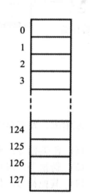
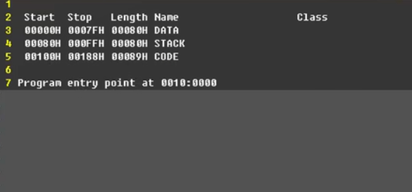

# 汇编语言学习

学习使用的书是王爽《汇编语言（第三版）》

#### 汇编语言的产生

由于机器语言难以记忆，阅读，编写，排错等一系列问题，于是汇编语言就产生了。

汇编语言的主体是汇编指令，汇编指令是机器指令便于理解的书写格式。

例如:机器指令1000 1001 1101 1000表示把寄存器BX的内容送到AX中。汇编指令则写成mov ax,bx。这样的写法与人类语言接近，便于阅读和记忆。
操作:寄存器BX的内容送到AX中.
机器指令: 100010011101 1000
汇编指令: mov ax,bx

#### 汇编语言的组成

汇编语言发展至今，有以下3类指令组成。

1. 汇编指令:机器码的助记符，有对应的机器码。
2. 伪指令:没有对应的机器码，由编译器执行，计算机并不执行。
3. 其他符号: 如+、-、*、1等，由编译器识别，没有对应的机码。

- 汇编语言的核心是汇编指令，它决定了汇编语言的特性。

#### 存储器

CPU是计算机的核心部件，它控制整个计算机的运作并进行运算。要想让一个CPU工作，就必须向它提供指令和数据。指令和数据在存储器中存放，也就是我们平时所说的内存。在一台PC机中内存的作用仅次于CPU。离开了内存，性能再好的CPU也无法工作。这就像再聪明的大脑，没有了记忆也无法进行思考。磁盘不同于内存，磁盘上的数据或程序如果不读到内存中，就无法被CPU使用。要灵活地利用汇编语言编程，我们首先要了解CPU是如何从内存中读取信息，以及向内存中写入信息的。

#### 指令和数据

指令和数据是应用上的概念。在内存或磁盘上，指令和数据没有任何区别，都是二进制信息。CPU在工作的时候把有的信息看作指令，有的信息看作数据，为同样的信息赋予了不同的意义。就像围棋的棋子，在棋盒里的时候没有任何区别，在对弈的时候就有了
不同的意义。
例如，内存中的二进制信息10001001 11011000，计算机可以把它看作大小为89D8H
的数据来处理，也可以将其看作指令mov ax,bx来执行。
1000100111011000 -> 89D8H (数据)
1000100111011000 - > mov ax,bx (程序)

#### 存储单元

存储器被划分成若千个存储单元，每个存储单元从0开
始顺序编号，例如一个存储器有128 个存储单元，编号从
0~127。



#### 寄存器分类

| 段寄存器       | DS、ES、SS、CS                                  |
| -------------- | ----------------------------------------------- |
| 偏移地址寄存器 | sp、bp、si、di、ip、bx                          |
| 组合规则       | 段寄存器x16+偏移地址寄存器，8086cpu有20根地址线 |

- CPU是如何区分指令和数据的？

  在任意时刻CPU将段地址寄存器CS和偏移地址寄存器IP所组合出来的地址，从中读取的数据全部当作指令来执行。

- 可以修改CS、IP这2个寄存器的指令

  `jmp  2000:0`

  `call xxx`

- 在任意时刻，在8086CPU中，将段寄存器SS和偏移地址寄存器SP所指向的内存地址当作栈的标记

- 一个栈最大的空间能设置多少？

  SP寄存器的范围：0000:FFFFH  总共可以放65536个字节，也就是32768个字形数据

#### 承上启下

- 我们在一段内存中存放存放了我们自己定义的数据

- 我们可以在一段内存中存放存放了我们自己定义的指令

- 我们可以将一段内存定义成 栈空间因为我们处理数据的时候需 要临时性的存放栈段

**我们如何让CPU按照我们的安排去访问这些内存段呢?**

- 对于数据段来说，段地址 -》ds 段地址寄存器[0],1[1...... mov add sub 指令去访问这些内存单元

**那么cpu就会将我们定义的数据段中的内容当作数据来访问**

- 对于代码段来说。我们可以 通过修改cs IP 这2个寄存器去指向 我们定义的代码段，这样CPU就将执行我们定义的代码段中的指令
- 这样cpu在执行栈的操作时比如push pop就会将我们定义的栈段当作栈空间使用进行临时性的数据存放或者取出
- 不管我们如何安排，CPU 将内存中某段内容当作指令是因为 CS; IP指向那里
- CPU将某段内存当作栈空间是因为ss; SP指向那里。
- 我们一定要清楚。我们是如何安排内存的。以及如何让CPU按照我们的安排去行事。
- 数据从哪里来？
- 指令从哪里来？
- 时性的数据存放到哪里去？
  取决于我们对CPU 中的地址寄存器的设置CS IP SS SP DS寄存器的设置

- 执行.exe文件的过程就是系统分配给我们内存的过程

### 编译和链接

编译masm asm -> obj
链接link obj -> exe

- 为什么需要分两步？而不是一步到位？

假设我们有100w行代码，编译器是翻译软件100万行 要翻译5分钟
代码是会有错误的去修改几行代码 ，这样一旦出错，修改后再编译非常浪费时间，也不利于找错。

如果把100万行代码拆分开来
t1.asm     ------>obj
t2.asm     ------>obj

t3.asm      ------>obj
t4.asm      ------>obj
t1000.asm  ---->obj

再通过链接把所有的obj文件连接在一起
得到最终的exe文件

### 系统要运行exe文件的话需要分配给他一段内存

- 系统是怎么知道要分配多大的内存给这个程序的?也就是这个exe 
  因为exe文件中除了我们整个程序的还包括了 一些信息
  文件有多大程序在哪里？
  描述信息
  系统就是根据这些描述信息对寄存器进行相关的设置

  

**start伪指令**

- start伪指令在exe 文件的描述信息中扮演什么角色?
  就是将我们设置的程序的入口地址在哪里记录在 exe文件的描述信息中。
  然后系统通过这个描述文件中的内容去设置cs: ip当然还有 一些其他内存
- exe可执行文件，不仅包括了我们整个程序，还包括了描述信息，系统就是根据这些描述信息进行相关的设置。

### 源文件 asm

**汇编语言程序**

```assembly
;将data段中的字母转化为大写
assume CS: code
data segment
	db 'conversation'
data ends
code segment
start:	mov ax,data
        mov ds, ax
        mov si,0
        ;ds:si指向字符串(批量数据)所在空间的首地址
        mov Cx, 12
        ;cx存放字符串的长度
        call capital
        mov ax, 4c00h
        int 21h
capital:and byte ptr [si], 11011111b
        inc si
        loop capital
        ret
code ends
end start
```

汇编指令：
被编译器翻译成 01010101 机器指令 机器码由CPU执行的
伪指令：
由编译器执行的
符号体系：
由编译器执行的
data segnent
告诉了编译器 data 段从这里开始
data ends 告诉了编译器data段在这里结束
段的名字可以随意取方面我阅读