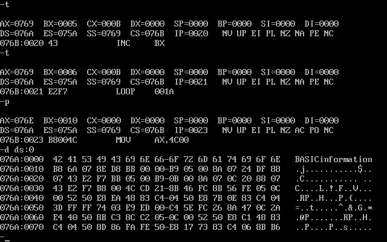
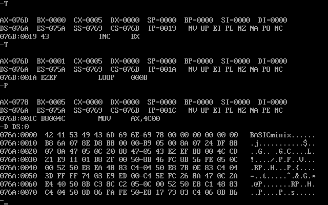
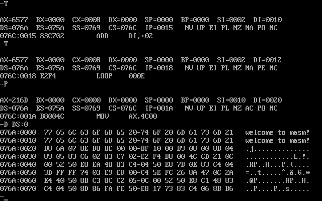
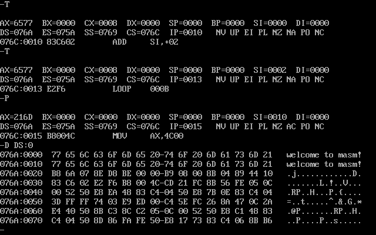
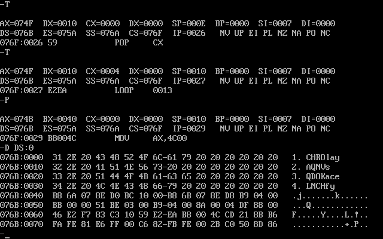

# 更灵活定位内存地址的方法

##### and 和  or

把`BaSIC` 全部字母转成大写，`iNfOrMaTiOn` 全部字母转成小写

```assembly
;把BaSIC第2个字母转成大写
;iNfOrMaTiOn全部变成小写
assume cs:code,ds:data

data segment
	db 'BaSIC'
	db 'iNfOrMaTiOn'
data ends

code segment

	start:  mov ax,data
	
			mov ds, ax      	;设置ds指向datd段
			mov bx, 0      		;设置(bx) =0,ds:bx指向'BaSiC'的第一个字母
			
			mov CX, 5      		;设置循环次数5,因为'BaSiC!有5个字母
			
		s:  mov al, [bx]   		;将ASCII码从ds:bx所指向的单元中取出
			
			and al, 11011111B  	;将al中的ASCII码的第5位置为0，变为大写字母
			
			mov [bx],al			;将转变后的ASCII码写回原单元
			
			inc bx; 			(bx)加1，ds:bx指向下一个字母
			
			1oop s
			
			mov bx, 5 			;设置(bx)=5, ds :bx指向'iNfOrMaTiOn '的第一一个字母
			
			mov Cx, 11			;设置循环次数11，因为'iNfOrMaTiOn'有11个字母
			
		s0:	mov al, [bx]
			or al, 00100000B  	;将al中的ASCII码的第5位置为1,变为小写字母
			
			mov [bx],al
			
			inc bx
			
			loop s0
			
			mov ax,4c00h
			
			int 21h

code ends

end start
			
```



##### 用[bx+idata]的方式进行数组的处理

把`BaSIC` 全部字母转成大写，`MinIX` 全部字母转成小写

```assembly
assume cs:code,ds:data

data segment
	db 'BaSIC'
	db 'MinIX'
data ends

code segment

	start:  mov ax,data
	
			mov ds, ax      	;设置ds指向datd段
			mov bx, 0      		;设置(bx) =0,ds:bx指向'BaSiC'的第一个字母
			
			mov CX, 5      		;设置循环次数5,因为'BaSiC!有5个字母
			
		s:  mov al, [bx]   		;将ASCII码从ds:bx所指向的单元中取出
			
			and al, 11011111B  	;将al中的ASCII码的第5位置为0，变为大写字母
			
			mov [bx],al			;将转变后的ASCII码写回原单元
			
			mov al,[5+bx]
			
			or al,00100000B
			
			mov [5+bx],al	
			
			inc bx				;(bx)加1，ds:bx指向下一个字母
			loop s
			
			mov ax,4c00h
			
			int 21h

code ends

end start
			
```



##### 问题7.2

```assembly
assume cs:code,ds:data

data segment
	db 'welcome to masm!'
	db '................'
data ends

code segment

	start:  mov ax,data
	
			mov ds,ax      		;设置ds指向data段
			
			mov si,0      		;设置(si) =0,ds:si指向要复制的原始字符串
			
			mov di,16
			
			mov CX,8      		
			
		s:  mov ax,[si]  		;从ds:si所指向的单元中取出
		
			mov [di],ax
			
			add si,2 		
			
			add di,2
			
			loop s
			
			mov ax,4c00h
			
			int 21h

code ends

end start
			
```



7.2改进版

```assembly
assume cs:code,ds:data

data segment
	db 'welcome to masm!'
	db '................'
data ends

code segment

	start:  mov ax,data
	
			mov ds,ax      		;设置ds指向data段
			
			mov si,0      		;设置(si) =0,ds:si指向要复制的原始字符串
			
			mov CX,8      		
			
		s:  mov ax,[si]  		;从ds:si所指向的单元中取出
		
			mov 16[si],ax
			
			add si,2 		
			
			loop s
			
			mov ax,4c00h
			
			int 21h

code ends

end start
			
```



##### 问题7.9

```assembly
;将datasg 段中每个单词的前4个字母改为大写字母

assume cs : codesg, ss: stacksg, ds : datasg
		
		stacksg segment
			dw 0,0,0,0,0,0,0,0
		stacksg ends
		
		datasg segment
			db '1. display      '
			db '2. brows        '
			db '3. replace      '
			db '4. modify       '
		datasg ends
		
		codesg segment
		
		start:	mov ax,stacksg
				mov ss,ax
				mov sp,16
				
				mov ax,datasg
				mov ds,ax
				
				mov cx,4
				mov bx,0
				
			s0: push cx
				mov si,3
				mov cx,4				
				
			s:	mov al,[bx+si]
				add al,11011111B
				mov [bx+si],al
				
				inc si
				
				loop s
				
				add bx,16
				
				pop cx
				
				loop s0
				
				mov ax,4c00h
			
				int 21h
			
		codesg ends
		end start

```

